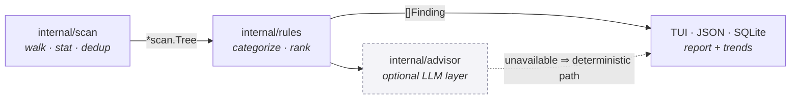

# ifiles

A macOS disk-space advisor for the terminal. Scans your home directory, works out
where the space actually went, and recommends what's safe to reclaim.

> [!IMPORTANT]
> **Status: design phase. No code yet.**
>
> This repository currently contains a plan and nothing else — there is no
> installable binary and none of the commands below run. Everything in this README
> describes intended behavior. See **[docs/IMPLEMENTATION_PLAN.md](docs/IMPLEMENTATION_PLAN.md)**
> for the full design, and [Roadmap](#roadmap) for what's actually built.

## Why

`du -sh *` tells you a directory is 41 GB. It doesn't tell you that it's Xcode's
`DerivedData`, that it regenerates itself on the next build, and that you can
delete the whole thing without thinking twice.

ifiles is the second half of that: size numbers plus **what the thing is, whether
it comes back on its own, and how risky it is to remove.**

It also tries to get macOS right, which is most of the actual work — see
[Accuracy on macOS](#accuracy-on-macos).

## Design commitments

Three decisions that shape everything else:

**Read-only.** v1 never deletes, moves, or modifies a single byte. It reports, and
hands you a command to copy if you want to act. Guarded deletion is a v2 feature
with dry-run defaults, a protected-path denylist, and per-item confirmation.

**Useful with no LLM.** The optional AI layer is off by default and can be removed
at compile time (`-tags nollm`). Every AI feature is an upgrade to a deterministic
feature that already works on its own — a curated ruleset does the categorizing, a
template writes the summary, flags drive the queries. With the LLM off there's no
degraded mode and no nagging: the feature simply isn't there.

**Your home directory, not your whole disk.** Default scan root is `$HOME`, where
the reclaimable space lives. Anything beyond that is an explicit flag.

## Planned usage

None of this works yet.

```console
$ ifiles                       # scan $HOME and open the TUI
$ ifiles report                # ranked recommendations, plain text
$ ifiles report --json         # machine-readable (schema v1)
$ ifiles dedup                 # find duplicate files
$ ifiles doctor                # check permissions and configuration
```

Filtering is deterministic and scriptable:

```console
$ ifiles report --category build-cache --min-size 1G --older-than 6m
$ ifiles report --ext mp4 --not-used-in 1y
```

### What it looks for

Curated rules covering the usual macOS offenders — Xcode `DerivedData`, simulator
runtimes and device support, `Docker.raw`, Homebrew/npm/Go/Cargo/Gradle caches,
`node_modules` across every project, local model weights, stale iOS backups,
Photos and Mail libraries, app caches, Trash, and forgotten downloads. Findings
are ranked by size × regenerability × staleness, so a 40 GB build cache untouched
for a year outranks a 40 GB photo library you open daily.

Rules are extensible via `~/.config/ifiles/rules.d/*.yaml`.

## Accuracy on macOS

Naive size-summing is wrong by tens of gigabytes on a modern Mac. Planned
handling, with the reasoning in [§2 of the plan](docs/IMPLEMENTATION_PLAN.md):

- **Physical vs logical size** — sparse and compressed files report an `st_size`
  far larger than the blocks they occupy. Both numbers are reported.
- **Hardlinks** counted once per `(dev, ino)`, not once per path.
- **Mount points** never crossed; no recursing into firmlinked `/System/Volumes/Data`.
- **Purgeable space** — local Time Machine snapshots and iCloud evictables are why
  Finder's free-space number disagrees with `df`. Explained rather than hidden.
- **iCloud-evicted files** are never opened during dedup, so scanning can't
  silently trigger a multi-gigabyte re-download.
- **Permission errors** are collected and reported, never fatal. `ifiles doctor`
  tells you what needs Full Disk Access.

**Known limitation:** APFS clones (copy-on-write copies made by Finder or `cp`)
share blocks on disk, but the OS reports each copy at full size and offers no
cheap way to detect the sharing. Totals may over-count in that case. ifiles will
say so in the report rather than implying precision it doesn't have.

## Optional: local or remote LLMs

Off by default. When enabled it adds four things, each layered over a working
deterministic equivalent:

| Feature | Without LLM | With LLM |
|---|---|---|
| Explanations | Templated ranked summary | Prose narrative with risk nuance |
| Unknown directories | Marker-file + extension heuristics | Named and judged for regenerability |
| Queries | `--category`, `--min-size`, `--older-than`, … | Same filters, from plain English |
| Duplicates | Exact hashing + filename similarity | Embedding clusters for related sets |

Local [Ollama](https://ollama.com) is the reference setup. The provider layer is
abstracted over [langchaingo](https://github.com/tmc/langchaingo), so remote APIs
are a config change rather than a rewrite.

**If you point it at a remote provider**, file paths become egress — and paths leak
employer, client, and project names. So: file contents are *never* sent, path
segments are hashed before leaving the machine, outbound hosts must match an
allowlist and fail closed, consent is requested once per profile while showing the
exact payload, and `--offline` hard-disables all remote calls. Embeddings stay
on-device even when chat is remote. Details in
[§9](docs/IMPLEMENTATION_PLAN.md#9-remote-llm-providers-designed-for-now-enabled-later).

## Architecture



The scan engine knows nothing about the UI, and the LLM never touches the
filesystem. Full diagram and package layout in
[§1](docs/IMPLEMENTATION_PLAN.md#1-architecture).

## Roadmap

Nothing is shipped yet. Milestones in build order:

| | Milestone | Delivers |
|---|---|---|
| ☐ | M0 · Scaffolding | CLI skeleton, config, CI |
| ☐ | M1 · Scan engine | Accurate accounting — the foundation |
| ☐ | M2 · Rules & recommendations | **`ifiles report` — the core product** |
| ☐ | M3 · TUI | Bubble Tea interface |
| ☐ | M5a · Duplicates | Exact + near-duplicate detection |
| ☐ | M6 · History | Snapshots and growth trends |
| ☐ | M7 · Web dashboard | React treemap over the same JSON |
| ☐ | M4 · LLM layer | Optional narration, classification, NL query |
| ☐ | M8 · Guarded reclaim | v2 — the first phase that writes anything |

M1 + M2 deliver the actual goal; the LLM milestone is deliberately last, since the
tool is complete without it.

## Requirements

- macOS (Apple Silicon or Intel) — the scanner is APFS- and macOS-specific by design
- Go 1.26+ to build
- Optional: [Ollama](https://ollama.com) for the AI layer, or an API key for a
  remote provider

## License

Not yet chosen.
