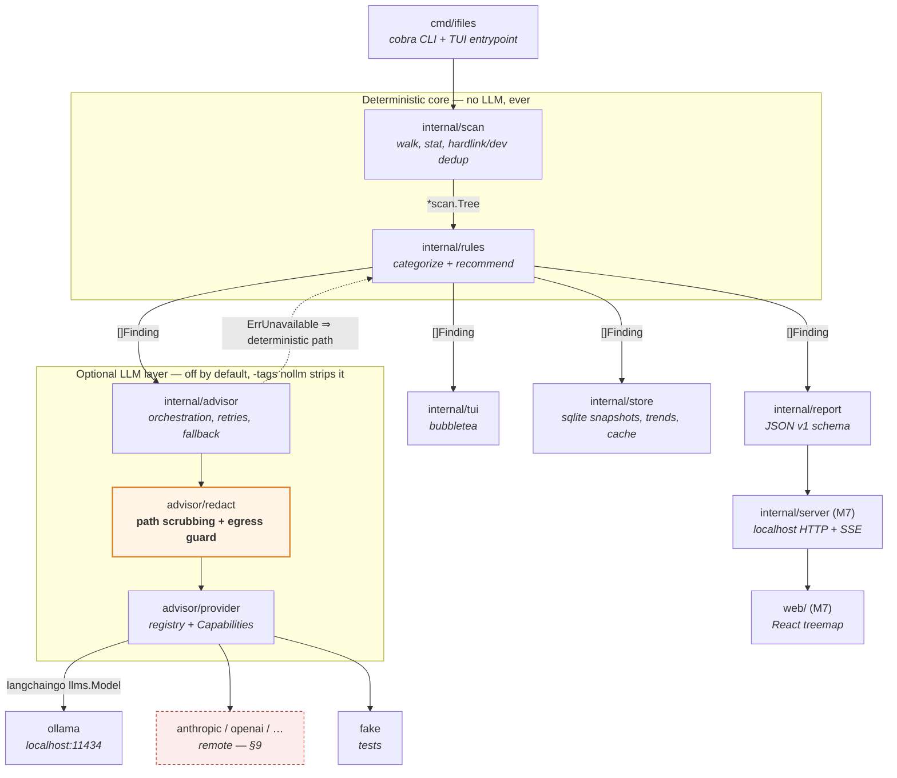
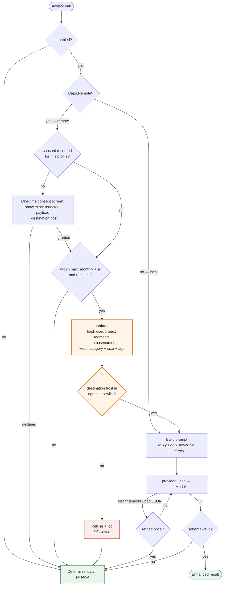

# ifiles — Implementation Plan

A macOS disk-space advisor. Scans, categorizes, and recommends where to reclaim
space. Terminal-first (Bubble Tea), with an optional React dashboard fed by the
same engine.

**ifiles is a complete, useful tool with no LLM at all.** The LLM layer is
strictly an optional enhancement — off by default, removable at compile time, and
**provider-agnostic**: local Ollama first, remote APIs supported by the same
interface. See §0 and §9.

## Decisions locked in

| Decision | Choice |
|---|---|
| UI | Go TUI first + headless JSON; React dashboard in a later phase over the same JSON |
| Mutation | **v1 is strictly read-only.** Guarded delete lands in v2 (M8) |
| LLM role | **Optional, off by default.** Explain/prioritize, classify unknown dirs, NL query, semantic dedup — each with a deterministic fallback |
| LLM providers | Provider-agnostic from day one. Ollama is the reference impl; remote providers are config, not a rewrite (§9) |
| Scan root | `$HOME` by default; anything beyond is opt-in via flag |
| Go | 1.26.3 (arm64) |
| LLM lib | `github.com/tmc/langchaingo` v0.1.14 — chosen *because* it abstracts ~15 providers behind one `llms.Model` |

---

## 0. Invariant: no-LLM is the default path

Not a fallback bolted on later — the primary product, built and tested first.
The LLM layer is additive on top of a tool that already stands alone.

**Rules that enforce it:**

1. **`[llm] enabled = false` ships as the default.** A fresh install never
   contacts Ollama, never waits on it, and never mentions it beyond one dim line
   in Settings. Opt in with `ifiles llm enable` or config.
2. **No feature exists only in the LLM path.** Every LLM capability is an
   *upgrade* to a deterministic feature that already works — see the table below.
   If a capability can't be built deterministically, it doesn't ship as a core
   view; it lives behind the LLM toggle and its absence is invisible.
3. **Compile-time removability.** All langchaingo imports live under
   `internal/advisor/provider/` behind a build tag. `go build -tags nollm`
   produces a binary with zero LLM dependencies (drops langchaingo and its
   transitive tree entirely). The default build includes it but stays inert.
4. **Milestone ordering guarantees it.** M1–M3 (engine, rules, TUI) contain no
   LLM code whatsoever. M4 is the first line of it, and by then the tool has
   already shipped something you'd use daily.
5. **No degraded-mode nagging.** With the LLM off, the UI shows no empty panes,
   no "enable AI!" prompts, no disabled-looking buttons. The Ask view simply
   isn't in the tab bar. It should feel like a tool that was designed without an
   LLM, because it was.

**Every LLM feature's deterministic counterpart:**

| Capability | Default (no LLM) | With LLM |
|---|---|---|
| Explain findings | `text/template` summary: ranked findings, sizes, category, regenerable flag, the `Why` string from the matching rule | Streamed prose narrative synthesizing across findings, with risk nuance |
| Classify unknown dirs | Marker-file heuristics (`package.json`, `Cargo.toml`, `.git`, `Info.plist`), extension histogram, dominant-file-type naming → `unknown` if no match | Model names the directory and judges regenerability, with a confidence score |
| Query | Flags/DSL: `--category build-cache --min-size 1G --older-than 6m --ext mp4`, composable and scriptable | NL string → the *same* `analyze.Query` struct the flags produce |
| Duplicate detection | Exact: size bucket → 64 KB xxhash → full hash. Plus filename/path token-overlap similarity (Jaccard on normalized segments) for near-dupes | Embedding clusters catching semantically-related sets that share no tokens |

Note the query row: the LLM produces exactly the struct the flags produce, so the
deterministic path isn't a lesser version — it's the same engine with a different
front end. This is the pattern to follow for anything added later.

**Corollary for remote providers (§9):** because the deterministic path is always
present, a remote provider is never a hard dependency either. A missing API key,
an expired credential, a rate limit, or an offline laptop all land in exactly the
same place as "Ollama isn't running" — the deterministic result, one dim line of
explanation. No new failure modes, just more of the same one.

**Testing consequence:** the default `go test ./...` run has zero LLM
involvement, and CI additionally runs `go build -tags nollm` plus the full suite
against it. LLM tests are opt-in only (§4).

---

## 1. Architecture

The rule that keeps this project from rotting: **the scan engine knows nothing
about the UI, and the LLM never touches the filesystem.**



Two things the diagram is doing deliberately:

- **`redact` sits between the advisor and every provider**, not off to the side.
  No provider — local or remote — can be wired up in a way that bypasses it. That
  single placement is why remote support is safe to add later.
- **The dotted edge back to `rules`** is the fallback path. Every advisor call has
  one; it's a structural feature, not error handling bolted on.

### Package layout

```
cmd/ifiles/                 main, cobra commands: scan, tui, report, dedup, doctor, serve
internal/scan/              walker, node tree, stat/size accounting, mountpoint guards
internal/rules/             rule engine + embedded default ruleset (YAML)
internal/rules/builtin/     rules.yaml — macOS known space hogs
internal/analyze/           dedup (exact), size rollups, staleness scoring
internal/advisor/           Advisor interface + Noop; orchestration, retries, fallback
internal/advisor/prompt/    prompt templates + JSON output schemas (provider-neutral)
internal/advisor/redact/    path scrubbing + egress guard — ALL providers route through
internal/advisor/provider/  registry, Capabilities, Config; one file per provider
internal/advisor/secret/    keychain-backed credential resolution (remote only)
internal/store/             sqlite snapshots, trend queries, LLM answer cache
internal/report/            versioned JSON/markdown/csv serialization
internal/config/            TOML config + env + flag precedence
internal/tui/               bubbletea app, one file per view
internal/server/            (M7) localhost HTTP + SSE, embeds web/dist
web/                        (M7) Vite + React + TypeScript treemap dashboard
docs/                       this plan, JSON schema, ruleset docs
testdata/                   synthetic fixture trees
```

### Core types (shape, not final signatures)

```go
// internal/scan
type Node struct {
    Name      string   // basename only; parent chain gives full path
    Parent    *Node
    IsDir     bool
    LogicalSz int64    // st_size
    PhysicalSz int64   // st_blocks * 512  — what actually costs you space
    ModTime   time.Time
    AccessTime time.Time
    Children  []*Node
    // rollups, filled bottom-up after walk
    TotalPhysical int64
    FileCount     int64
    DirCount      int64
}

type Tree struct {
    Root      *Node
    Volume    VolumeInfo // statfs: total, free, and macOS "purgeable" caveat
    Skipped   []SkipReason
    Stats     WalkStats  // duration, nodes/sec, errors
}
```

```go
// internal/rules
type Category string // "build-cache", "package-cache", "vm-image", "media",
                     // "app-cache", "backup", "model-weights", "trash", "unknown", ...

type Rule struct {
    ID          string
    Match       []string // doublestar globs, $HOME expanded
    Category    Category
    Regenerable bool     // true = deleting costs you only rebuild time
    Risk        Risk     // safe | review | dangerous
    Why         string   // human explanation shown in the UI
    Hint        string   // e.g. "xcrun simctl delete unavailable"
    MinSize     int64    // don't bother reporting under this
}

type Finding struct {
    Path        string
    Category    Category
    Bytes       int64
    Regenerable bool
    Risk        Risk
    Rule        string // rule ID, or "" if LLM-classified
    Staleness   time.Duration
    Score       float64 // ranking: bytes × regenerable-weight × staleness
    Narrative   string  // filled by advisor, optional
}
```

```go
// internal/advisor — the seam that makes the LLM optional.
// Deliberately provider-neutral: no Ollama types, no base URLs, no model names.
type Advisor interface {
    Narrate(ctx context.Context, s Summary) (<-chan string, error) // streaming
    Classify(ctx context.Context, dirs []DirSample) ([]Classification, error)
    ParseQuery(ctx context.Context, nl string) (analyze.Query, error)
    ClusterSimilar(ctx context.Context, paths []string) ([]Cluster, error)
    Caps() provider.Capabilities
    Available(ctx context.Context) error // for `ifiles doctor`
}
```

`advisor.Noop` — the **default** implementation, and the one compiled under
`-tags nollm` — returns `ErrUnavailable` for everything. Callers are required to
handle that by taking the deterministic path from §0's table; there is no code
path where an unavailable advisor produces an error dialog, a blank pane, or a
hang. Reviewing a `Noop` call site means asking "what does this render with no
model?", and the answer is never "nothing".

`Available()` uses a short timeout (2 s for local, 5 s for remote) so a hung
daemon or a captive-portal Wi-Fi can't stall startup. Unreachable and disabled are
the same thing as far as the UI is concerned.

**Why `Caps()` exists:** providers differ in what they can do — not every one
offers embeddings (needed for M5b), and remote ones have cost and rate limits that
local ones don't. Features query capabilities rather than sniffing provider names,
so adding a provider never means editing feature code:

```go
// internal/advisor/provider
type Capabilities struct {
    Chat        bool
    Streaming   bool
    Embeddings  bool   // M5b requires this; gracefully absent otherwise
    JSONMode    bool   // native structured output vs prompt-and-parse
    Remote      bool   // ⇒ redaction mandatory, consent required, costs money
    MaxContext  int    // prompt budget is derived from this, not hardcoded
}

type Factory func(ctx context.Context, cfg Config) (llms.Model, Capabilities, error)

// Registry is populated by per-provider files via init(); the advisor never
// imports a concrete provider package directly.
func Register(name string, f Factory)
func Open(ctx context.Context, cfg Config) (llms.Model, Capabilities, error)
```

---

## 2. macOS specifics that will bite us

Getting these right is most of the value; a naive `filepath.WalkDir` + `st_size`
sum will be wrong by tens of gigabytes.

1. **Logical vs physical size.** APFS sparse files and compressed files report an
   `st_size` far larger than allocated blocks. Use `syscall.Stat_t.Blocks * 512`
   as the primary number, keep logical for display. Report both.
2. **Hardlinks.** Count `(Dev, Ino)` once. Time Machine and some app bundles are
   full of them. Without this, totals inflate badly.
3. **APFS clones.** `cp` on APFS is copy-on-write; two 5 GB "copies" may cost
   5 GB total, and `st_blocks` reports 5 GB *each*. There is no cheap public API
   to detect shared extents. **Document this as a known over-count** and surface
   it in the UI as a caveat rather than pretending precision we don't have.
4. **Mount points.** Compare `st_dev` against the root's; do not cross into
   `/Volumes`, network mounts, or firmlinked `/System/Volumes/Data` (which would
   otherwise loop).
5. **Purgeable space.** macOS reports free space including purgeable (local Time
   Machine snapshots, iCloud evictables). `statfs` free bytes will disagree with
   Finder. Shell out to `tmutil listlocalsnapshots /` and note snapshot count;
   explain the discrepancy in the report instead of hiding it.
6. **Permissions.** `~/Library/Containers`, `~/Library/Mail`,
   `~/Library/Messages` need Full Disk Access. Collect `EACCES` into
   `Tree.Skipped` and have `ifiles doctor` print the exact System Settings path
   to grant it. Never abort a scan on a permission error.
7. **iCloud dataless files.** Files evicted to iCloud have `st_size` set but no
   local blocks. Reading them triggers a download — so **never open file contents
   during dedup without checking `SF_DATALESS`/`ATTR_CMNEXT_...` first.** A
   dedup pass that silently re-downloads 200 GB from iCloud would be a serious
   bug.
8. **Symlinks** are never followed; recorded as their own tiny entries.

---

## 3. Phases

Each milestone is independently useful and independently demoable.

### M0 — Scaffolding
- `go mod init github.com/shaynemeyer/ifiles`; cobra root + `--json`, `--verbose`.
- `internal/config`: TOML at `~/.config/ifiles/config.toml`, precedence
  **flags > env (`IFILES_*`) > file > defaults**. `ifiles config init` writes a
  commented default.
- `just`/`make` targets: build, test, lint (golangci-lint), fixtures.
- CI: build + test on macOS.

**Done when:** `ifiles --help` works and config round-trips.

### M1 — Scan engine (the foundation; get this right)
- Worker-pool walker: bounded goroutines over `os.ReadDir`, `unix.Lstat` for
  `Stat_t`. Target: `$HOME` (~1M inodes) in well under a minute warm.
- All seven macOS gotchas above implemented and unit-tested.
- Bottom-up rollup pass; `Tree` fully populated.
- Progress reported via a channel (`ScanProgress{Path, Nodes, Bytes}`) so both
  CLI and TUI can render it.
- `ifiles scan --json` emits schema v1. This is the contract the React app will
  later consume, so version it from day one.

**Done when:** on a fixture tree with sparse files, hardlinks, and a nested mount
stub, totals match hand-computed expectations exactly. Plus a smoke test against
real `$HOME` comparing against `du -sk` per top-level dir with documented
tolerance.

### M2 — Rules & recommendations (deterministic; **this is the product**)
Embedded `rules.yaml` covering the real macOS offenders:

- **Xcode**: `DerivedData`, `iOS DeviceSupport`, `CoreSimulator/Devices`,
  `Archives`, old toolchains
- **Containers**: `Docker.raw` / `com.docker.docker` VM disk, Colima, Podman
- **Package caches**: Homebrew (`brew --cache`), npm/pnpm/yarn, Go module cache
  (`go env GOMODCACHE`), Cargo registry, `~/.gradle`, `~/.m2`, pip/uv
- **Project detritus**: `node_modules`, `.venv`, `target/`, `build/`,
  `__pycache__` — rolled up as "N project trees, X GB total"
- **Model weights**: `~/.ollama/models`, HuggingFace cache, LM Studio
- **Backups**: `MobileSync/Backup` (flag ones older than 6 months)
- **Media/mail**: Photos library, `~/Library/Mail`, Messages attachments
- **App caches**: `~/Library/Caches/*`, Slack/Discord/Spotify/browser caches
- **Trash & Downloads**: `~/.Trash`, stale `~/Downloads`

Scoring: `bytes × regenerable_weight × staleness_factor`, so a 40 GB DerivedData
untouched for a year outranks a 40 GB Photos library you use daily.

Rules are user-extensible via `~/.config/ifiles/rules.d/*.yaml`, merged over
builtins by rule ID. Hand-written rules are *better* than model guesses for known
paths — precise, instant, free, and reviewable — so the ruleset is where effort
goes, not the prompt.

Also in M2, because they're the no-LLM half of §0's table:
- **Marker-file classification** for unknown dirs (`package.json`, `Cargo.toml`,
  `go.mod`, `.git`, `Info.plist`, `*.xcodeproj`) plus extension-histogram naming
  ("mostly .mp4 — media"). Falls through to `unknown` honestly rather than
  guessing.
- **`text/template` narrative** — the deterministic version of Narrate. Ranked
  findings with sizes, categories, and each rule's `Why` string. This must read
  well on its own; it's what most users will see.
- **Query flags** — `--category`, `--min-size`, `--older-than`, `--not-used-in`,
  `--ext`, `--path-contains`, building the same `analyze.Query` struct M4's NL
  parser will later emit.

**Done when:** `ifiles report` prints a ranked, categorized, human-readable table
with a credible "estimated reclaimable" total on a machine **that has never had
Ollama installed** — and you'd genuinely use it in that state. If it isn't
useful here, no amount of M4 will fix it.

### M3 — TUI (Bubble Tea) — *the front door; budget real time here*

This is the product's face and gets first-class treatment. See
**§8 TUI design spec** for the full brief. Summary of the build order:

1. **Design system first** (`internal/tui/theme`): tokens, not ad-hoc styles.
2. **Layout primitives**: responsive frame, header, footer/statusline, focus
   model, scroll containers. Get these right before any view.
3. **Views**: Overview → Browse → Recommendations → Duplicates (M5a) →
   Trends (M6) → Settings. Ask arrives with M4 and is absent otherwise.
4. **Polish pass**: animation, empty/error/loading states, help overlay.

Scan runs in a goroutine feeding `tea.Msg`; the UI never blocks for a single
frame, and `esc` cancels a running scan cleanly.

**Done when:** you can scan and explore `$HOME` without touching a flag, at 80
and 200 columns, in light and dark terminals, and it feels deliberate rather than
assembled.

### M4 — LLM integration (optional layer; everything before this must ship first)

Built behind `//go:build !nollm` in `internal/advisor/ollama_*.go`. Enabling it
adds capability; it never becomes load-bearing.

- `advisor.Ollama` on langchaingo `llms/ollama`. Per-task model config:

```toml
[llm]
enabled  = false                       # DEFAULT — opt in via `ifiles llm enable`
provider = "ollama"                    # ollama | none
base_url = "http://localhost:11434"
timeout  = "120s"
autodetect = false                     # never probe for Ollama unless asked

[llm.models]
narrate  = "qwen3.8:27b-mlx"           # quality matters, latency doesn't
classify = "mistral-nemo:12b"          # fast, called in batches
query    = "mistral-nemo:12b"          # must be snappy and reliable at JSON
embed    = "nomic-embed-text:latest"

[llm.privacy]
redact_paths = true   # hash user/project name segments before sending
max_prompt_kb = 24    # hard cap; rollups are truncated to fit
```

- **Narrate** — send *aggregated rollups only* (top N findings: category, bytes,
  age, regenerable), never raw file lists. Stream tokens into the TUI.
- **Classify** — for `unknown` dirs above a size threshold, send a small sample
  (dir name, child name samples, extension histogram, size, mtime) and get back
  `{category, regenerable, confidence, reasoning}` constrained to a JSON schema.
  Cache in SQLite keyed by a path+shape signature so a rescan is free.
- **ParseQuery** — NL → `analyze.Query{Categories, MinSize, OlderThan, NotUsedIn,
  Extensions, PathContains, Limit}`. Validated in Go, executed in Go. The model
  emits JSON only; **it never emits shell, paths to delete, or SQL.**
- Malformed JSON → one retry with the validation error appended → then fall back
  to the deterministic path and say so once, quietly.
- `ifiles doctor` reports Ollama status **only when the LLM is enabled**;
  otherwise it doesn't mention it. With it enabled, it checks reachability and
  that each configured model is pulled, offering a copy-pasteable `ollama pull`.

**Done when** all three hold:
1. `ifiles ask "big videos I haven't opened in a year"` returns correct results.
2. Killing `ollama` mid-session leaves every view fully functional on the
   deterministic path, with one dim banner — no hang, no crash, no empty pane.
3. `go build -tags nollm && go test ./...` passes, and the resulting binary has
   no langchaingo in `go version -m`. Verify with
   `go build -tags nollm -o /tmp/ifiles-nollm . && go version -m /tmp/ifiles-nollm | grep -c langchaingo` → 0.

### M5 — Duplicates
**M5a — no LLM, ships independently of M4:**
- Exact: bucket by physical size → hash first 64 KB (xxhash) → full-file hash
  only for surviving buckets. Skip hardlink twins and **skip dataless/iCloud
  files entirely** (see gotcha 7). Exact hashing needs no model and is the
  higher-confidence result anyway.
- Near-dupe heuristic: normalize path segments (strip `-copy`, ` 2`, dates,
  version suffixes) and cluster on token Jaccard similarity. Catches
  `project/`, `project-old/`, `project 2/` cheaply and deterministically.

**M5b — optional embedding layer (requires M4):**
- `nomic-embed-text` over *paths and filenames only* — never content — for a
  capped candidate set (project roots and media, a few thousand max, not every
  inode). Cosine-cluster to surface related sets that share no tokens. Vectors
  cached in SQLite.

Clusters show a suggested keeper (newest / shallowest path) and a clear note that
v1 will not delete anything.

**Done when:** planted duplicate fixtures are found with zero false positives on
exact matching **with the LLM disabled**; M5b is additive and its clusters are
labeled *suggestions*, not facts.

### M6 — History & trends
- Persist each scan as a snapshot (`modernc.org/sqlite`, pure Go — no cgo, keeps
  cross-compilation trivial). Store rolled-up nodes above a size floor, not every
  inode.
- Diff two snapshots: "`~/Downloads` +8.2 GB since Aug 1", "DerivedData is back".
- `ifiles scan --snapshot` for cron/launchd; Trends view in the TUI.

**Done when:** two scans a day apart produce a meaningful, correct growth report.

### M7 — React dashboard
- `ifiles serve` → `127.0.0.1:7777`, **localhost-bound only**, random per-run
  token in the URL, no external network exposure. Vite/React/TS build embedded
  via `embed.FS` so the binary stays single-file.
- `GET /api/v1/scan` (schema v1), `GET /api/v1/findings`, `GET /api/v1/events`
  (SSE progress). `POST /api/v1/ask` returns `501` with a clear body when the LLM
  is disabled, and the React app hides the Ask panel based on a
  `GET /api/v1/capabilities` response rather than assuming it exists.
- Treemap (d3-hierarchy) + sunburst, category filters, click-to-drill, findings
  panel mirroring the TUI. Same JSON, zero duplicated logic.

**Done when:** the dashboard renders a real scan and the TUI still works with
`web/` deleted.

### M8 — Guarded reclaim (v2 — the only phase that mutates anything)
Not started until M1–M3 are solid (M4 is not a prerequisite — deletion must never
depend on a model being present). Layered safety:
1. **Dry-run is the default.** `--apply` is required to do anything.
2. Move to `~/.Trash` via `NSFileManager`-equivalent semantics; real `unlink`
   needs `--no-trash` *and* an interactive confirmation.
3. Hardcoded denylist: `/System`, `/usr` (non-local), `/Library` outside caches,
   `~/Library/Keychains`, anything outside the scan root, and any path the rule
   engine marked `dangerous`.
4. Per-item explicit multi-select — never "delete all recommendations".
5. Append-only JSONL audit log of every action with sizes and timestamps.
6. **The LLM is never in the deletion path.** It may annotate; it may not select
   targets. Every deletion traces back to a deterministic rule plus an explicit
   human keypress.

---

## 4. Testing

- **Fixture generator** (`testdata/gen.go`): builds a synthetic tree with sparse
  files, hardlinks, symlinks, deep nesting, unicode names, a fake DerivedData,
  planted duplicates. Golden-file assertions on scan output.
- **Scanner**: table tests in `t.TempDir()`; explicit tests per macOS gotcha.
- **Rules**: table tests mapping path → expected category/risk.
- **TUI**: `teatest` for key-sequence snapshots.
- **Benchmark**: walk throughput on the fixture tree, tracked to catch regressions.

**No-LLM is the baseline, and CI enforces it:**

- `go test ./...` (the default, no tags) runs with `advisor.Noop` and touches
  Ollama zero times. Any test that needs a model must be tag-gated, or it's a bug.
- `go build -tags nollm` + full suite against it, as a separate CI job. This is
  the check that catches a langchaingo import leaking into a core package —
  the failure mode that would quietly make the LLM mandatory.
- **Fallback-parity tests**: for each row of §0's table, assert the deterministic
  path produces a valid, non-empty result. Explicitly assert the LLM-off render of
  every view is non-empty and contains no error text.
- `teatest` snapshots are captured **with the LLM disabled** — that's the default
  user's screen, so it's what regressions should be measured against. LLM-on
  snapshots are a separate, tagged set.
- **Advisor** (tagged): `Advisor` interface mocked for unit tests; a
  `-tags=ollama` integration test skips when Ollama isn't reachable.
  Prompt-contract tests assert we reject malformed model JSON rather than
  trusting it, and that rejection lands on the deterministic path.

## 5. Dependencies

| Purpose | Module |
|---|---|
| CLI | `spf13/cobra` |
| TUI | `charmbracelet/bubbletea`, `bubbles`, `lipgloss` |
| TUI text | `charmbracelet/glamour` (markdown-lite), `rivo/uniseg` (width math) |
| TUI tests | `charmbracelet/x/exp/teatest` |
| Globs | `bmatcuk/doublestar/v4` |
| Syscalls | `golang.org/x/sys/unix` |
| Hashing | `cespare/xxhash/v2` |
| SQLite | `modernc.org/sqlite` (pure Go) |
| Config | `BurntSushi/toml` |
| LLM *(optional, `!nollm` only)* | `tmc/langchaingo` v0.1.14 — `llms/ollama`, `llms/anthropic`, `llms/openai`, `llms/fake`, `embeddings` |

Everything above the LLM row is required; langchaingo is the only dependency that
can be compiled out. Nothing outside `internal/advisor/provider/` may import it —
worth a CI grep, since a stray import elsewhere silently breaks `-tags nollm`.

**On keeping langchaingo:** an earlier draft of this plan noted that raw
`net/http` against Ollama's API would be a reasonable way to drop the dependency,
since a local-only build uses a thin slice of the library. Multi-provider support
inverts that: hand-rolling clients for Anthropic, OpenAI, and OpenAI-compatible
gateways — each with its own auth, streaming format, and error shape — is exactly
the work langchaingo already did. Keep it.

Caveat that still applies: langchaingo is pre-1.0 and its API moves between minor
versions. Pin the version, and confine it to `provider/` so an upgrade touches one
package. `llms.Model` is the stable-ish core; the per-provider constructors are
where churn shows up.

## 6. Rough sequencing

M0 → **M1 (largest single chunk)** → M2 → M3 → **M5a** → M6 → M7 → *M4* → M8.

Note M4 moved late: with the LLM off by default, it's the lowest-priority
milestone, not a mid-project centerpiece. M1+M2 already deliver the stated goal —
*reports that recommend where to save space* — and M3 makes them pleasant to use.
M5a (exact dedup) and M6 (trends) are both fully deterministic and add more real
value than narration does, so they come first.

If effort has to be cut, cut M4 and M7 entirely; the tool is complete without
them. Don't cut corners in M1 — M5 and M6 both assume its accounting is correct.

Remote providers (§9) are **M4b**, after M4 proves the seams with Ollama. The only
M4 obligation is not painting into a corner — see §9.6 for the four things that
must be true, all of which are cheap to do up front and expensive to retrofit.

## 7. Open questions (non-blocking; defaults chosen)

1. **Distribution** — Homebrew tap, or `go install` only? Defaulting to
   `go install` for now; a tap is trivial to add later.
2. **Ollama concurrency** — batch classification could saturate a 27B model on
   the Mac's unified memory. Defaulting to serial classification calls with a
   configurable concurrency of 1; raise it if profiling says there's headroom.
3. **Scheduled scans** — launchd agent for weekly snapshots is attractive for
   M6's trends but adds an install surface. Deferring; `ifiles scan --snapshot`
   is cron-ready either way.
4. **Remote embeddings** — M5b needs an embedder. Assuming embeddings stay local
   (`nomic-embed-text`) even under a remote chat profile, since embedding thousands
   of candidate paths is the worst possible thing to pay per-token for. Revisit
   only if you want ifiles usable on a machine with no local model at all.

---

## 8. TUI design spec

Target quality bar: a terminal app that looks *designed*, in the vein of Claude
Code, `lazygit`, and `k9s`. The things that separate those from a typical Bubble
Tea app are not features — they're restraint, a consistent type/color scale,
correct width math, and never dropping a frame.

### 8.1 Principles

1. **One accent color, earned.** A single accent for focus and primary action.
   Everything else is a neutral ramp. Color carries meaning (risk, category) or
   it isn't used. Rainbow TUIs read as amateur.
2. **Hierarchy through weight and space, not boxes.** Prefer whitespace, dim
   text, and a single hairline rule over nested rounded borders. At most one
   border level on screen.
3. **Density with air.** Consistent 1-cell gutters, 2-cell content inset, blank
   line between logical groups. Never let text touch a border.
4. **Motion is feedback, never decoration.** Spinner while scanning, a brief
   count-up on totals, 120 ms ease on panel focus. Nothing loops idly.
5. **Always answer "what can I press?"** A persistent footer of context-sensitive
   keys. No hidden modes.
6. **Never block.** Every long operation streams progress and is cancellable.
   A frozen TUI destroys trust faster than any missing feature.

### 8.2 Design tokens (`internal/tui/theme`)

Every style resolves from tokens; no `lipgloss.Color("205")` literals in view
code. This is what makes the whole app feel like one thing.

```go
type Palette struct {
    // neutrals — a 6-step ramp, the backbone of the UI
    Bg, BgSubtle, Border, TextFaint, TextMuted, Text lipgloss.AdaptiveColor
    // single accent + states
    Accent, AccentFg lipgloss.AdaptiveColor
    Success, Warn, Danger, Info lipgloss.AdaptiveColor
    // category ramp — one hue per Category, low saturation, colorblind-safe
    Category map[rules.Category]lipgloss.AdaptiveColor
}
```

- `lipgloss.AdaptiveColor` throughout so light and dark terminals both look
  intentional. Verify against Solarized Light and a default dark profile.
- Degradation ladder detected once at startup: **truecolor → 256 → 16 → no
  color**. `NO_COLOR`, `TERM=dumb`, and non-TTY output all handled; risk and
  focus must remain legible with zero color (use glyphs + weight).
- Risk encoding: `safe` = muted green dot, `review` = amber, `dangerous` = red
  with a `!` glyph. Never color alone.

### 8.3 Layout

Responsive breakpoints, computed on every `tea.WindowSizeMsg`:

| Width | Layout |
|---|---|
| `< 80` | single column, compact rows, sidebar collapses to a tab strip |
| `80–119` | single column, comfortable spacing |
| `≥ 120` | two-pane: list left (fixed 40%), detail right |
| `≥ 160` | three-pane: nav rail, list, detail |

Vertical: fixed header (2 rows) + flexible body + fixed footer (1 row, 2 when a
scan is running). Body height is always computed, never assumed — the single most
common source of janky TUIs.

The block below is a **terminal mockup, not a diagram** — it stays monospace
because it depicts literal character-cell output, which is the artifact being
specified. Architecture and flow diagrams elsewhere in this doc are Mermaid.

```
┌ ifiles ─────────────────────────────── ~/  •  312 GB / 494 GB ──────────────┐
│  Overview   Browse   Recommend   Duplicates   Trends                        │  ← tabs, accent underline on active
│                                                                             │     (+ "Ask" only when LLM enabled)
├─────────────────────────────────────────────────────────────────────────────┤
│                                                                             │
│  Reclaimable          ▄▄▄▄▄▄▄▄▄▄▄▄▄▄▄▄░░░░░░░░░░░░░░░░  84.2 GB             │
│                       of 312 GB used                                        │
│                                                                             │
│  TOP OFFENDERS                                                              │
│  ● Xcode DerivedData        ███████████████████▏  41.3 GB   regenerable     │
│  ● Docker.raw               ████████▎             18.7 GB   review          │
│  ● Ollama models            ██████▏               14.2 GB   review          │
│  ● node_modules  ×37        ████▊                  9.8 GB   regenerable     │
│  ● Homebrew cache           ██▏                    4.1 GB   regenerable     │
│                                                                             │
│  ⚠  3 paths skipped (needs Full Disk Access) · APFS clones may over-count    │
│                                                                             │
├─────────────────────────────────────────────────────────────────────────────┤
│ ⠋ scanning ~/Library/Caches … 412k files · 1.2m/s        tab switch  ? help │
└─────────────────────────────────────────────────────────────────────────────┘
```

Detail: bars are drawn with eighth-block glyphs (`▏▎▍▌▋▊▉█`) for sub-cell
resolution — the cheapest single upgrade in perceived quality over `#` bars.

### 8.4 Interaction model

- **Keys**: vim-first (`j/k`, `g/G`, `ctrl+d/u`, `h/l` to ascend/descend in
  Browse), arrows always work too. `tab`/`shift+tab` cycle views, `1`–`6` jump
  directly. `/` filter, `s` sort, `?` help overlay, `esc` cancel/back, `q` quit.
- **Focus** is explicit and visible: focused pane gets the accent border, blurred
  panes drop to `Border` and dim their text. Never ambiguous.
- **Filter/sort state persists** per view and is shown as a chip in the header.
- **Help overlay** is a centered modal listing only the current view's bindings,
  generated from the same keymap struct that handles input — so it can't drift.
- **Copy actions** (`y` yanks the reclaim command / path) with a 2-second toast.
  In v1 this is how anything gets "done"; make it feel good.

### 8.5 States — the part that's usually skipped

Every view implements all five, explicitly:

| State | Treatment |
|---|---|
| **Loading** | Braille spinner + live path + counters. Skeleton rows, not a blank screen. |
| **Streaming** | Bars and totals update in place as the walk progresses; no full-screen redraw flicker. |
| **Empty** | A sentence explaining why it's empty and the one key that fixes it. Never a bare blank pane. |
| **Error** | Inline, specific, actionable — "Full Disk Access required for ~/Library/Mail · `o` opens System Settings". Never a raw Go error string. |
| **Degraded** | Only for a *failed* LLM call while enabled: one dim inline line, then the deterministic result. With the LLM simply off there is no degraded state — the Ask tab isn't rendered and nothing hints at a missing feature. |

### 8.6 Text & numbers

- Sizes: 3 significant figures, binary units, always aligned on the decimal
  (`41.3 GB`, `1.02 TB`, `847 MB`). One formatter, `format.Bytes`, used
  everywhere.
- Paths: middle-truncate with `…` preserving the meaningful tail
  (`~/Library/…/DerivedData`). Never truncate the basename.
- Counts use thin separators (`412,193`). Relative times are humanized
  ("3 months ago").
- **All width math via `lipgloss.Width` / `uniseg`**, never `len()`. Unicode
  filenames, CJK wide chars, and emoji in path names will otherwise shred the
  layout — and on a real `$HOME` they *will* be present.

### 8.7 Streaming LLM output *(optional layer)*

Tabs are built from a capability list, not a constant: with the LLM disabled the
tab bar is `Overview · Browse · Recommend · Duplicates · Trends` and the number
keys renumber accordingly. No greyed-out tab, no placeholder pane. The mockup in
§8.3 shows the default (LLM-off) layout.

The narration view is where the "Claude Code feel" lands: tokens arrive from
Ollama over a channel, are word-wrapped incrementally, and render with a subtle
cursor block at the tail. Wrap on word boundaries as text arrives (buffer the
partial trailing word) so lines don't reflow visibly. Markdown-lite rendering via
`glamour`, restricted to bold/bullets/inline-code so the output stays terminal-
native. `esc` interrupts generation and keeps what already arrived.

### 8.8 Performance budget

- **Never block `Update`.** All I/O in `tea.Cmd` goroutines.
- Coalesce scan progress to ~20 fps; a channel firing per-file would spend all
  its time rendering. Throttle in the producer, not the view.
- Virtualize long lists — render only the visible window. `~/Library/Caches`
  alone can produce tens of thousands of rows.
- Memoize rendered rows keyed by (content, width); invalidate on resize.
- Target: <16 ms per frame at 200 columns with a 1M-node tree loaded.

### 8.9 Verification

- `teatest` golden snapshots at 80, 120, and 200 columns for every view and every
  one of the five states — this is what prevents visual regressions.
- Manual matrix: Ghostty, iTerm2, Terminal.app, tmux; dark and light; `NO_COLOR=1`.
- A `--demo` flag loads a fixture scan so the TUI can be developed and
  screenshotted without waiting on real walks. Worth building on day one of M3.

---

## 9. Remote LLM providers (designed for now, enabled later)

Remote support is a **config change plus one file**, not a refactor — provided the
seams in §1 hold. Nothing in this section needs to be built during M4; it needs to
be *not precluded* by M4. Concretely, M4 must avoid three mistakes: putting a
`base_url` in the `Advisor` interface, assuming latency is single-digit
milliseconds, and assuming tokens are free.

### 9.1 Adding a provider

langchaingo already wraps ~15 backends behind `llms.Model` — verified present in
v0.1.14: `anthropic`, `openai`, `googleai`, `bedrock`, `mistral`, `cohere`,
`huggingface`, `watsonx`, `cloudflare`, `llamafile`, `local`, `fake`. So a new
provider is roughly:

```go
//go:build !nollm

package provider

func init() {
    Register("anthropic", func(ctx context.Context, cfg Config) (llms.Model, Capabilities, error) {
        key, err := secret.Resolve(ctx, cfg.CredentialRef) // keychain / env, never config file
        if err != nil { return nil, Capabilities{}, err }
        m, err := anthropic.New(anthropic.WithToken(key), anthropic.WithModel(cfg.Model))
        return m, Capabilities{
            Chat: true, Streaming: true, JSONMode: true,
            Embeddings: false,        // use a local embedder for M5b instead
            Remote: true, MaxContext: cfg.MaxContext,
        }, err
    })
}
```

That's the whole integration. **`Remote: true` is the important line** — it's what
flips redaction, consent, and budget enforcement on, so a provider author can't
forget to opt into them.

Note `Embeddings: false` above: embedding every candidate path is exactly the
workload you don't want to pay per-token for. Keep `nomic-embed-text` local even
when chat is remote — hence the split model config below.

### 9.2 Config

Providers are named profiles, so switching is one line and per-task routing
falls out naturally — cheap local model for batch classification, strong remote
model for narration:

```toml
[llm]
enabled = false
profile = "local"          # which [llm.profiles.*] to use

[llm.profiles.local]
provider = "ollama"
base_url = "http://localhost:11434"
models   = { narrate = "qwen3.8:27b-mlx", classify = "mistral-nemo:12b",
             query = "mistral-nemo:12b", embed = "nomic-embed-text:latest" }

[llm.profiles.cloud]
provider       = "anthropic"
credential_ref = "keychain:ifiles-anthropic"   # NOT the key itself
models         = { narrate = "…", classify = "…", query = "…" }
embed_profile  = "local"      # keep embeddings on-device even when chat is remote
max_monthly_usd = 5.00
require_consent = true

[llm.profiles.corp]
provider       = "openai"     # any OpenAI-compatible gateway
base_url       = "https://llm.internal.example/v1"
credential_ref = "env:IFILES_LLM_KEY"
```

`ifiles llm use cloud` switches profiles; `ifiles llm test <profile>` does a
round-trip check and prints the provider, model, and resolved capabilities.

### 9.3 The part that actually matters: egress

Sending filesystem paths to a third party is categorically different from sending
them to `localhost`. Paths leak employer names, client names, project codenames,
and personal details. `advisor/redact` is therefore mandatory and
non-bypassable for any provider with `Remote: true`:



Every branch that isn't a clean success lands on the deterministic path. That's
the invariant from §0 doing real work: **there is no error state to design,
because there is no failure that isn't already a supported mode.**

Rules `redact` enforces:

1. **Never send file contents.** Not for classification, not for dedup, not ever.
   Only metadata: category, size, age, extension histograms, depth.
2. **Redact by default when `Remote`** (`redact_paths` cannot be set false for a
   remote profile without `--i-understand`). Username, project, and client-looking
   segments are replaced with stable hashes, so the model still sees structure
   (`~/dev/<proj-a1b2>/node_modules`) and answers are mappable back locally.
3. **Egress allowlist.** Outbound hosts must match the configured provider's
   expected host or an explicit `allowed_hosts`. Fail closed on mismatch — this is
   what catches a typo'd or hostile `base_url`.
4. **One-time informed consent per profile**, showing the *actual* redacted
   payload that would be sent and the destination host. Recorded in config with a
   timestamp; re-prompted if the provider or host changes.
5. **`--offline` / `IFILES_OFFLINE=1`** hard-disables every remote provider
   regardless of config. Useful on a plane, on a client's network, or in CI.

### 9.4 Operational differences from local

| Concern | Local (Ollama) | Remote |
|---|---|---|
| Latency | 10s of ms to first token | 100s of ms; needs real spinners and cancellation |
| Failure | daemon down | timeouts, 429s, 5xx, expired keys, captive portals |
| Retries | pointless | exponential backoff + jitter, `Retry-After` honored, cap 2 attempts |
| Cost | zero | metered; track tokens in `store`, enforce `max_monthly_usd`, show spend in Settings |
| Secrets | none | macOS Keychain via `security(1)`; **never** written to config or logs |
| Batching | fine to loop serially | batch classification into one call; per-item calls get expensive fast |
| Prompt size | generous | derive from `Caps.MaxContext`; trim rollups to fit rather than erroring |

### 9.5 Testing

- `llms/fake` (ships with langchaingo) backs deterministic advisor tests with no
  network and no daemon — this is what most advisor tests should use.
- `httptest` servers simulating 429, 500, truncated streams, and malformed JSON;
  assert every one lands on the deterministic path.
- **Redaction tests are the critical ones:** a table of realistic paths asserting
  no raw username, project name, or basename appears in the outbound payload.
  Plus a fuzz test over path shapes.
- **Egress test:** point a "remote" profile at an unexpected host and assert the
  call is refused before any bytes leave the process.
- Cost accounting: assert the budget ceiling actually blocks a call.

### 9.6 What to get right during M4 (cheap now, expensive later)

Even though remote ships later, four things must be true when M4 lands:

1. `Advisor` and `prompt/` stay provider-neutral — **no Ollama types or URLs above
   the `provider` package.** This is the one that's genuinely hard to retrofit.
2. `redact` exists and is on the call path from day one, even though local usage
   makes it near-trivial. Adding a mandatory guard later means auditing every call
   site; having it there means one flag flip.
3. `Capabilities` gates features from the start, so nothing hardcodes
   "embeddings are available".
4. Prompt budget derives from `Caps.MaxContext`, never a constant.

Everything else — keychain, budgets, consent UI, backoff — is genuinely additive
and can wait.
